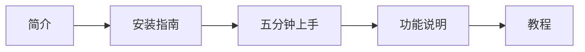

# 快速开始

欢迎使用 PointWorks！本节将帮助你快速了解和上手这款专业三维点云处理软件。

## 学习路径

!!! tip "推荐阅读顺序"
    如果你是第一次使用 PointWorks，建议按照上述顺序依次阅读。

## 文档导航

| 页面 | 说明 |
|------|------|
| [简介](introduction.md) | 了解 PointWorks 的功能定位和技术架构 |
| [安装指南](installation.md) | 下载并安装 PointWorks |
| [五分钟上手](quick-start.md) | 快速体验核心功能 |
